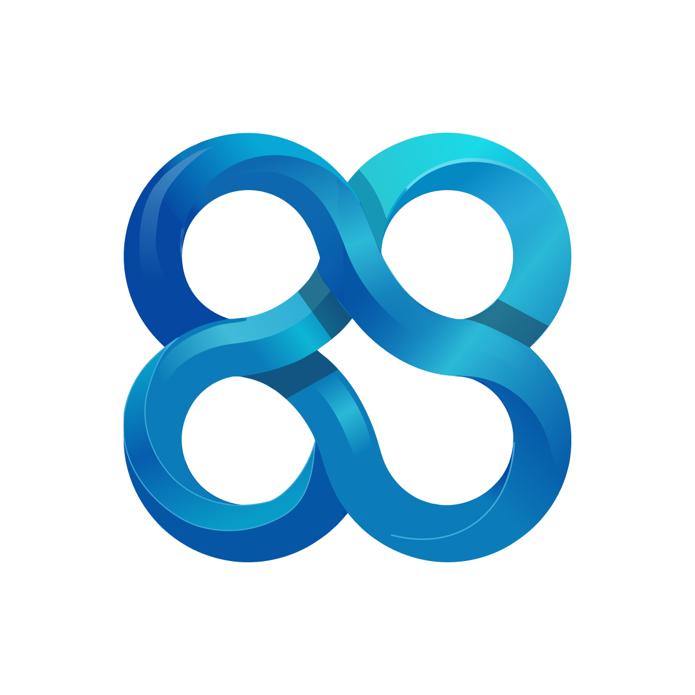

<p align="center">
  
  <h2 align="center">Client for OpenProject</h2>
  <p align="center">An unofficial mobile client for OpenProject</p>
</p>

---

<h3>📱 Screenshots</h3>

<table align="center">
  <tr>
    <td align="center"><b>Splash</b></td>
    <td align="center"><b>Server</b></td>
    <td align="center"><b>Token</b></td>
  </tr>
  <tr>
    <td></td>
    <td></td>
    <td></td>
  </tr>
    <tr>
    <td align="center"><b>Home</b></td>
    <td align="center"><b>Work Packages</b></td>
    <td align="center"><b>Add Work Package</b></td>
  </tr>
  <tr>
    <td></td>
    <td></td>
    <td></td>
  </tr>
</table>

---

## 🌟 Key Features
* **📊 Project Overview**: Navigate through your workspace with ease.
* **🚀 Comprehensive Work Package Management**: View, track, and update work packages.
* **🔒 Security**: Follows a "Local-Only" paradigm. Sensitive data (e.g. API tokens) never leaves the device.
* **🌐 Open Source**.

---

## 🏗️ App Architecture

This application is built using a modular, **4-layer architecture**.

### 📐 Layer Overview

| Layer | Responsibility | Key Components |
| :--- | :--- | :--- |
| **Presentation** | UI rendering and state management. | Screens, Widgets, Cubits |
| **Application** | Shared logic and cross-cubit coordination. | Controllers |
| **Data** | External API communication and data fetching. | Repositories |
| **Models** | Plain Dart classes representing data structures. | Data Models |

---

### 🧬 Technical Implementation

#### 1. Presentation Layer (Primary)
Renders the UI, handles user interactions and state management.
* **UI**: Divided into `screens` and `widgets` to improve reusability.
* **Cubits (State Management)**: Using the BLoC pattern.

#### 2. Application Layer (Optional)
Acts as a coordinator for logic that resides outside the widget tree:
* **Stateless Logic**: Handles utility functions.
* **Cubit Linking**: Manages interactions between multiple cubits (e.g., refreshing a list when a setting changes).

#### 3. Data Layer
Handles all asynchronous communication with the **OpenProject REST API**:
* **Repositories**: Abstract the data source, fetching raw JSON and returning mapped models.
* **Connectivity**: Communicates directly with your OpenProject instance via the `http` package.

#### 4. Models Layer
The foundational blueprints for the application.

---

### 🔄 Unidirectional Data Flow

1.  **UI**: User triggers an event (e.g., "Load Projects").
- *Optional: Controller (Application layer) triggers extra logic -when needed- before forwarding the request to the cubit.*
2.  **Cubit**: Forwards the request to the Data Layer and emits a `Loading` state.
3.  **Data Layer**: Fetches data from the API and returns a **Model**.
4.  **Cubit**: Receives the model and emits a `Success` state.
5.  **UI**: Rebuilds automatically via `BlocBuilder` to display the data.


- *Note: Cubit listeners are found in `Controllers` (Applicaton layer), (e.g. when a cubit emits a `Loading` state).*


---

### 📂 Directory Structure

```text
lib/
└── features/
    └── example_feature/
        ├── presentation/     # 🟡 UI & Cubits
        ├── application/      # 🟠 Controllers & Shared Logic
        ├── data/             # 🔵 Repositories (API)
        └── models/           # 🟢 Data Models
```
---

## 🚀 Getting Started

Follow these instructions to set up the development environment and run the **Client for OpenProject** on your local machine.

### 📋 Prerequisites

Before you begin, ensure you have the following installed:
* **Flutter SDK**: Version `3.2.3 - 4.0.0`
* **Dart SDK**: Integrated with Flutter
* **Android Studio / VS Code**: With Flutter and Dart plugins
* **Java Development Kit (JDK)**: Required for Android builds

### 🛠️ Installation & Setup

1. **Clone the repository**:

   ```bash
   git clone https://github.com/your-username/openproject_client.git
   cd client-for-openproject
   ```
2. **Install dependencies:**

   ```bash
   flutter pub get
   ```
3. **Environment Configuration:**

   Create a .env file in the root directory, paste this template inside it:
   ```
    FIREBASE_APIKEY=place_key_here
    FIREBASE_APP_ID=place_id_here
    FIREBASE_MESSAGING_SENDER_ID=place_id_here
    FIREBASE_PROJECT_ID=place_id_here
    FIREBASE_STORAGE_BUCKET=place_bucket_here
    ```
    Then use your own keys.
4. **Run the Application:**

   ```bash
   flutter run
   ```
5. **Compiling for Production**:

   ```bash
   flutter build appbundle --release
   ```

---

### 📜 License & Credits

- ⚖️ **License**
  - This project is licensed under the **MIT License** - see the [LICENSE](LICENSE) file for details.
  - ❗**Important**: This is an **unofficial** client and is not affiliated with, endorsed by, or sponsored by *OpenProject GmbH*.

- 🤝 **Credits**

<table>
  <tr>
    <td align="center">
      <a href="https://github.com/syk-yaman">
        
        <br><b>Yaman Kalaji</b>
      </a>
    </td>
    <td align="center">
      <a href="https://github.com/MajdHajHmidi">
        
        <br><b>Majd Haj Hmidi</b>
      </a>
    </td>
    <td align="center">
      <a href="https://github.com/ShaabanShahin">
        
        <br><b>Shaaban Shahin</b>
      </a>
    </td>
  </tr>
</table>
